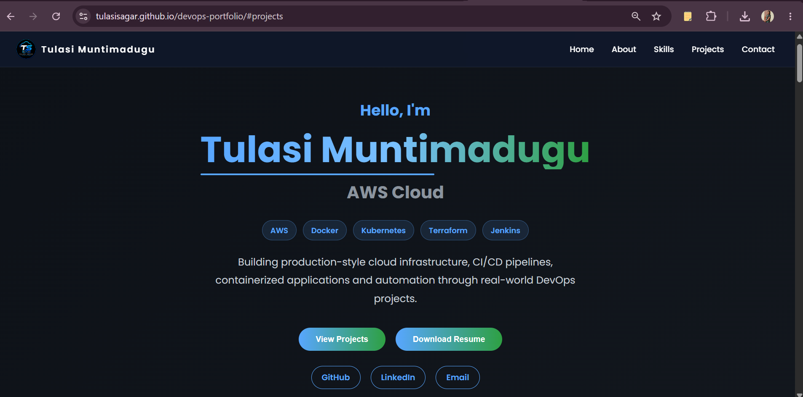

# 🌐 DevOps Portfolio Website

[](https://tulasisagar.github.io/devops-portfolio/)
[](https://github.com/tulasisagar/devops-portfolio)
[]
[]
[]

---

## 📖 About

This repository contains my personal **DevOps Portfolio Website**, designed to showcase my technical skills, certifications, hands-on DevOps projects, and professional journey.

The portfolio is fully responsive, mobile-friendly, and hosted using **GitHub Pages**.

It serves as a central place where recruiters and hiring managers can explore my work, GitHub repositories, resume, and professional profiles.

---

## 🚀 Live Portfolio

🌐 **Portfolio Website**

**https://tulasisagar.github.io/devops-portfolio/**

---

## ✨ Features

- 🎨 Modern and clean UI
- 📱 Fully responsive design
- 🧭 Sticky navigation bar
- 👨‍💻 Professional Hero section
- 📂 DevOps Project Showcase
- 📜 Certifications section
- 🛠 Technical Skills section
- 📄 Resume download
- 🔗 GitHub & LinkedIn integration
- 📬 Contact section
- ⚡ Fast loading website

---

## 🛠️ Tech Stack

### Frontend

- HTML5
- CSS3
- JavaScript (ES6)

### Tools

- Git
- GitHub
- GitHub Pages
- VS Code

---

## 📂 Project Structure

```text
devops-portfolio/
│
├── images/
│   ├── favicon.png
│   └── (portfolio images)
│
├── resume/
│   └── Tulasi_Muntimadugu_DevOps_Resume.pdf
│
├── index.html
├── style.css
├── script.js
└── README.md
```

---

## 📸 Portfolio Preview

> 

Example:

```
images/portfolio-preview.png
```

Then display it like this:

```markdown

```

---

## 💼 Featured DevOps Projects

This portfolio highlights my hands-on DevOps projects, including:

- ☁️ AWS Three-Tier Architecture
- 🐧 Linux & Shell scriot Automation
- 🔄 Jenkins CI/CD Pipeline
- 🚀 TravelBookStall DevOps Platform

Each project includes:

- Detailed documentation
- Architecture diagrams
- Screenshots
- Troubleshooting guide
- Learning outcomes

---

## 📜 Certifications

- ✅ Docker Basics Assessment
- ⏳ AWS Certified Cloud Practitioner (In Progress)
- ✅ LinkedIn Recruiter & Talent Insights

---

## 📄 Resume

My latest DevOps resume can be downloaded directly from the portfolio website.

---

## 🖥️ Run Locally

Clone the repository

```bash
git clone https://github.com/tulasisagar/devops-portfolio.git
```

Move into the project directory

```bash
cd devops-portfolio
```

Open the project

```text
Open index.html in your browser
```

Or use VS Code Live Server.

---

## 🚀 Future Enhancements

- 🌙 Dark / Light mode toggle
- 📖 Technical Blog section
- ☁ More AWS projects
- 🌍 Terraform & Infrastructure as Code projects
- 🔄 ArgoCD GitOps projects

---

## 📬 Connect With Me

### 🌐 Portfolio

https://tulasisagar.github.io/devops-portfolio/

### 💻 GitHub

https://github.com/tulasisagar

### 💼 LinkedIn

https://www.linkedin.com/in/tulasi-sagar/

---

## 👨‍💻 Author

**Tulasi Muntimadugu**

Aspiring DevOps Engineer passionate about Cloud Computing, Automation, CI/CD, Kubernetes, Linux, and AWS.

---

## ⭐ Support

If you like this project, consider giving it a ⭐ on GitHub.

It motivates me to continue learning, building, and sharing DevOps projects.

---

## © License

This project is open-source and intended for learning, portfolio, and demonstration purposes.
